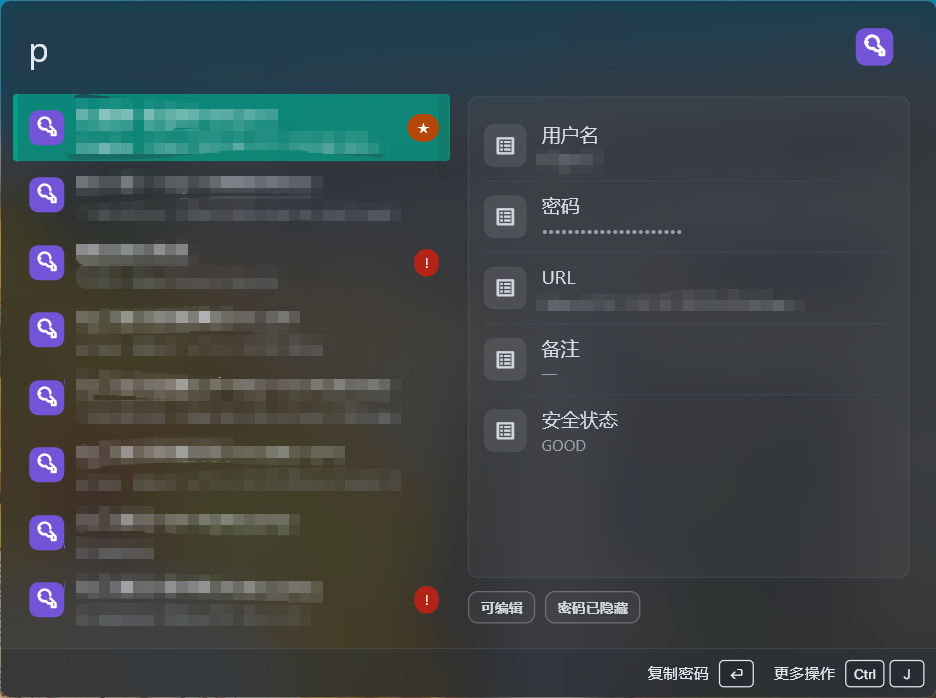

# Nextcloud Passwords for Wox

Search, inspect, copy, and update entries from the [Nextcloud Passwords](https://apps.nextcloud.com/apps/passwords) app without leaving Wox.



## Features

- Type `ncp <search>` to search labels, usernames, and URLs locally after the encrypted vault is loaded. Chinese labels and usernames support full-pinyin, initials, partial-syllable, and mixed literal/pinyin matching.
- Authorize through the official Nextcloud Login Flow v2 in the system browser. The Nextcloud account password is never entered in Wox.
- Type `ncp connect` to authorize or replace this device's connection and `ncp disconnect` to revoke it.
- Press Enter to copy the selected password.
- Automatically rank entries by local copy frequency and most recent use. Search relevance still takes priority while typing.
- Pin or unpin editable entries. Pinning uses the Nextcloud Passwords favorite field and syncs across devices.
- Copy the username from the result action menu.
- Open the entry URL in the default browser. Bare domains such as `example.com/login` use HTTPS automatically.
- Inspect username, URL, notes, security status, and a masked password in the preview panel.
- Toggle the password between masked and plaintext display in the preview. Every new query starts hidden.
- Edit label, username, password, URL, and notes. Updates retain the entry's existing encryption mode and use the latest server revision.
- Supports server-side encryption and Passwords CSEv1 end-to-end encryption through the official `passwords-client` library.
- Supports user-entered Passwords session 2FA codes. Request-based or push authentication methods currently require upstream client support.

## Setup

1. Install and enable the Passwords app on an HTTPS Nextcloud server.
2. Install this plugin and configure only the HTTPS Nextcloud URL in Wox plugin settings.
3. Type `ncp connect`, press Enter, and approve the official Login Flow v2 request in the system browser. The request expires after 20 minutes if it is not completed.
4. Type `ncp`. If end-to-end encryption is enabled, Wox shows an unlock form. The encryption passphrase stays in memory for the Passwords API session and is never saved by the plugin.

Nextcloud generates a dedicated app password for this device during authorization. Type `ncp disconnect` to remove the local connection and revoke that app password on the server.

## Privacy and security

- Passwords are decrypted only in the plugin process and are not written to disk by this plugin.
- Search runs locally because encrypted label, username, and URL fields cannot be searched server-side.
- Result metadata never contains plaintext passwords. The password is only sent to Wox when copying it or after the explicit reveal action.
- Copy frequency and last-used time are stored locally as a hidden, device-specific Wox setting and are not synchronized to Nextcloud.
- Login Flow credentials are stored as hidden, platform-specific Wox settings so every device receives a separate revocable app password and the token is not cloud-synced by this plugin.
- Editing a password uses a blank **New password** field. Leave it blank to preserve the current password.

## Development

```bash
pnpm install
pnpm check
pnpm package
```

The package command creates `wox.plugin.NextcloudPasswords.wox`.
